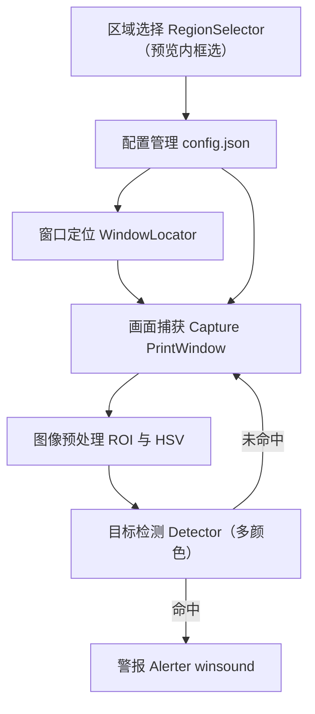
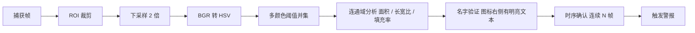

# EVE 端游本地红名预警工具 · 开发文档与技术栈规划

> 一款纯本地、只读截屏、零内存改动的轻量化预警工具：玩家框选游戏界面任意区域，工具在该区域内识别敌对红名，命中即触发本地警报。

| 项目 | 内容 |
| --- | --- |
| 文档版本 | v1.0 |
| 成稿日期 | 2026-08-29 |
| 目标平台 | Windows 10 / 11 |
| 前置定位 | 纯本地、只读截屏、零内存改动 |

---

## 1. 项目定位与设计原则

在《EVE Online》中，敌对玩家在总览（Overview）与太空视野中以特定颜色名称标识（默认红 / 橙红 / 橙色）。本工具的目标是充当一台**「只读屏幕阅读器」**：它只读取操作系统已经渲染到屏幕上的像素，对指定游戏窗口画面做实时捕获，在玩家自定义的监控区域内按所选颜色检测目标，一旦命中立即播放本地警报音。

整个方案被四条不可妥协的设计红线约束，它们决定了后续所有技术选型：

- **只读截屏：** 仅通过操作系统图形接口读取屏幕像素，与 OBS、截图软件同属一类读操作，不触碰游戏进程内存。
- **零内存 / 零注入：** 不使用 ReadProcessMemory、不 OpenProcess 读写、不注入 DLL、不挂 Hook，从机制上规避反作弊风险。
- **完全本地：** 无任何网络请求、无数据上传、无遥测，配置与警报音全部落盘本地。
- **轻量低耗：** 只处理玩家选定的 ROI（Region of Interest），采用低帧率 + 下采样 + 纯颜色判定的高效管线。

> **核心设计决策：** 目标识别不依赖模型推理或模板库，而采用**基于 HSV 颜色空间的预设颜色阈值分割**。这是满足「轻量化 + 低延迟 + 无需训练」的最简可靠路径——阈值运算在 OpenCV 的 C/C++ 后端执行，单帧处理量级为毫秒级，配合 ROI 限定、识别程度调节与时序确认即可稳定达到 90% 以上准确率。

---

## 2. 需求分析

### 2.1 功能需求

| 编号 | 功能 | 说明 |
| --- | --- | --- |
| FR-1 | 游戏窗口实时捕获 | 精准定位并获取指定的 EVE 端游窗口画面，支持窗口化、无边框全屏等常见模式。 |
| FR-2 | 自定义区域选择 | 玩家通过鼠标框选游戏界面中的特定区域作为监控 ROI，坐标以归一化方式保存。 |
| FR-3 | 目标识别 | 在自定义区域内按所选颜色准确识别出现的敌对目标（默认红 / 橙红 / 橙 / 灰白）。 |
| FR-4 | 警报触发 | 检测到目标时立即持续循环播放预设警报音，目标消失即停止（无冷却）。 |
| FR-5 | 完全本地化 | 不包含任何网络请求或数据上传功能，全程离线运行。 |
| FR-6 | 反作弊安全 | 不修改内存、不注入、不 Hook，仅做只读屏幕捕获。 |

### 2.2 非功能需求

| 类别 | 指标 | 要求 |
| --- | --- | --- |
| 可靠性 | 识别准确率 | ≥ 90%（对玩家选定 ROI 内的目标） |
| 可靠性 | 响应延迟 | ≤ 300 ms（目标出现到警报响起，目标 ≤ 100 ms） |
| 兼容性 | 操作系统 | Windows 10 / 11 |
| 兼容性 | 分辨率 / 窗口模式 | 1080p、1440p、4K；窗口化、无边框全屏（独占全屏按可用性自动回退） |
| 资源占用 | CPU / 内存 | 低功耗运行，空闲时 CPU 占用显著低于 1 个逻辑核心 |

---

## 3. 技术栈选型

选型的第一性原则是：**性能瓶颈全部下沉到 C/C++ 库，语言层只做「胶水」**。截屏由 PrintWindow（GDI）与 mss 的 C 实现完成，图像处理由 OpenCV 的 C++ 后端完成，因此即便用 Python 作调度层，逐帧开销也可忽略，却能换来最短的迭代周期。这也是本工具首选 Python 而非 C++/C# 的根本原因。

### 3.1 语言 / 运行时方案对比

| 方案 | 优点 | 缺点 | 结论 |
| --- | --- | --- | --- |
| Python 3.11 + OpenCV | 开发最快、CV 生态最全、易校准调参 | 打包体积偏大（约 50–80 MB） | **首选（MVP）** |
| C# / WPF + OpenCvSharp | 原生 Windows 集成好、二进制小、遮罩 UI 自然 | 开发慢、CV 生态相对弱 | 备选 |
| C++ + DXGI + OpenCV | 性能与体积最优 | 开发成本高、维护难 | 进阶重写 |

### 3.2 最终选型清单

| 层 | 选型 | 选型理由 |
| --- | --- | --- |
| 语言 | Python 3.11+ | 开发快、生态全，性能由底层 C 库承担。 |
| 屏幕捕获 | PrintWindow（窗口内容渲染），mss（BitBlt）兜底 | PrintWindow 直接渲染目标窗口自身画面，被遮挡时也只捕获所选窗口；独占全屏等失效场景回退 mss 屏幕抓取。 |
| 图像处理 | OpenCV + NumPy | 颜色阈值、形态学、轮廓均在 C++ 后端高速执行。 |
| 窗口定位 | pywin32（win32gui） | 按进程名 / 窗口标题枚举并命中目标窗口，读取窗口矩形；含最小化状态检测。 |
| GUI | PySide6 | 控制面板、自动适应预览控件（预览内框选）、目标程序选择对话框。 |
| 音频 | winsound（stdlib） | SND_LOOP 循环播放 WAV，识别即播直到目标消失；文件缺失回退 Beep。 |
| 配置 | 本地 JSON | 无数据库、无网络，符合完全本地化要求。 |
| 打包 | PyInstaller / Nuitka | 产出免安装 exe；Nuitka 编译后可进一步降低运行开销与启动时间。 |

---

## 4. 系统架构

工具由七个内聚模块组成一条「捕获 → 预处理 → 检测 → 报警」的主链路。区域选择把玩家框选的 ROI 归一化坐标写入配置，捕获模块据此只抓取窗口对应矩形，从而把后续所有计算限制在最小范围。



---

## 5. 模块设计

各模块职责单一、通过配置与内存中的帧数据松耦合，便于单独测试与替换。核心接口与实现要点如下。

| 模块 | 职责 | 关键技术点 |
| --- | --- | --- |
| window_locator | 定位并锁定目标窗口 | EnumWindows 按进程名 / 标题匹配；GetClientRect 与 ClientToScreen 取真实边框；IsIconic 最小化检测。 |
| capture | 按窗口内容抓取画面 | PrintWindow（PW_RENDERFULLCONTENT）直接渲染目标窗口自身画面，被遮挡也只捕获所选窗口；失败回退 mss 屏幕抓取。 |
| region_selector | ROI 坐标归一化换算 | 预览画面内鼠标框选，记录起止点并转为窗口归一化坐标存储；越界自动钳制。 |
| detector | 目标识别 | 多颜色 HSV 阈值并集 + 连通域 + 图标几何筛选（面积自适应 / 长宽比 / 填充率）+ 两级名字验证 + 连续 N 帧时序确认。 |
| alerter | 触发警报 | winsound SND_LOOP 循环播放，识别到目标即持续警报直到目标消失（无冷却）；缺失回退 Beep。 |
| config | 配置读写 | 本地 JSON 保存窗口标识、ROI、启用颜色与识别程度等；与默认值深度合并。 |
| logger | 日志记录 | 统一 logging：项目根 logs/ 滚动文件 + 控制台，级别可配置，覆盖生命周期事件与异常。 |

### 5.1 窗口定位

通过进程名（EVE 客户端进程，如 `exefile.exe`）枚举顶层窗口，命中后读取窗口客户区矩形。注意 Windows 的 DPI 缩放会使逻辑坐标与物理像素不一致，须调用 `SetProcessDpiAwarenessContext(PER_MONITOR_AWARE_V2)`，否则在高 DPI 下捕获位置会偏移，导致 ROI 错位。

### 5.2 区域选择与坐标归一化

框选在**控制面板的预览画面内**通过鼠标拖拽完成（不覆盖被监控程序界面，也不影响其他应用操作）。框选的 ROI 以**窗口内的归一化坐标**（0–1 的 x/y 比例）保存，而非绝对像素。这样玩家切换分辨率或改变窗口尺寸后，监控区域仍自动跟随原位置，无需重新框选。实际抓取时再由当前窗口尺寸换算回像素坐标，框选越出预览边界时自动钳制到可视边缘。

### 5.3 日志与运行诊断

工具内置统一日志（`core/logger.py`），面向「排查识别误报 / 漏报、窗口定位失败、捕获异常」等实际排障场景：

- **输出**：项目根 `logs/eve-alert.log` 滚动文件（默认 2MB、保留 3 份）+ 控制台；级别与文件路径可经 `config.json` 的 `logging` 段调整（`level` / `file`）。
- **格式**：`时间 | 级别 | 模块 | 消息`（如 `2026-08-29 23:38:52 | INFO | detector | ...`）。
- **覆盖事件**：程序启停、配置载入/保存、窗口定位命中与否、捕获方式（PrintWindow / mss 回退）、检测命中（图标个数 + 连续帧数）、警报启停与暂停/恢复、以及含 traceback 的异常。
- **级别约定**：`INFO` 记录生命周期与命中；`WARNING` 记录可恢复问题（未找到窗口、捕获回退、目标最小化、警报音缺失）；`ERROR` 记录致命错误；`DEBUG` 记录逐帧检测明细（仅在排查误报时把级别调到 debug）。

---

## 6. 核心算法：目标识别

目标识别的核心是颜色分割。EVE 总览中，每个玩家名字**前方**都有一个实心小图标（近正方形，尺寸随名字字体大小可调，可由玩家自定义）用于区分友军 / 敌对 / 中立，图标颜色可在总览设置中更改为「样例/总览可选颜色.png」所列 12 种预设之一（对应「警报颜色」）；而名字文字本身始终是白色 / 灰白，不随阵营变化。因此本方案按**「图标」**而非「文字条形」检测，且判定**不以固定像素为准**。

总览名称支持红、橙红、橙、灰白、绿、青绿、深青、蓝、天蓝、紫、品红、黑共 12 种预设颜色（其中彩色 10 种 + 灰白 / 黑色 2 种无色相色），玩家按需勾选警报颜色。彩色在 HSV 色相环上以中心色相 ± 半带宽描述，红色跨色相环两端需拆为两个区间拼接；灰白 / 黑则用明度区间描述。整条流水线如下。



### 6.1 颜色阈值初值

每种颜色以「中心色相 + 识别严格度」描述，识别程度滑块（宽松 ~ 严格）按比例线性插值：宽松时色相带宽更大、饱和度 / 明度下限更低（更易命中）；严格时带宽收窄、下限抬高（更苛刻、误报更少）。以下为 OpenCV HSV 空间（H∈[0,179]、S∈[0,255]、V∈[0,255]）的两端初值。

| 类别 | 参数 | 宽松端 | 严格端 | 说明 |
| --- | --- | --- | --- | --- |
| 彩色（10 色） | 色相半宽 | ±14 | ±4 | 围绕各色中心色相；严格时收窄，避免相邻色彩串扰 |
| 彩色（10 色） | 饱和度下限 | 70 | 140 | 越高越排除粉白灰 |
| 彩色（10 色） | 明度下限 | 40 | 75 | 越高越排除暗部 |
| 灰白 | 明度下限 | 88 | 100 | 无色相；下探以捕获较暗的中立图标（V≈107–123），白色名字文字靠填充率剔除 |
| 黑色 | 明度上限 | 100 | 55 | 无色相，只认更暗的黑色 |

彩色各色的中心色相（H）：红 0（跨环）、橙红 10、橙 21、绿 60、青绿 87、深青 89、天蓝 109、蓝 113、紫 138、品红 138。各启用的颜色区间掩码做按位或合并，再进入形态学处理。

### 6.2 误报与漏报抑制

检测目标由「文字条形」改为「阵营图标」后，针对误报与漏报有两套针对性抑制：

- **连通域 + 图标几何筛选：** 在颜色掩码上做连通域分析，保留「近方形 + 高填充率」的紧凑色块。判定**不以固定像素为准**：游戏内可自定义名字字体 / 图标大小，故面积下限仅剔除噪点级小色块、上限按**帧面积比例**留出余量，中间任意尺寸的小方块都保留；外接矩形长宽比约束在 0.7–1.6。**填充率按颜色类别区别对待**——彩色图标在下采样后填充率会降至 0.7–0.8，故彩色用常规填充率（≥0.70）；而**名字文字是白色/灰白，只会污染「灰白」掩码**，因此灰白用更高填充率（≥0.82，下采样后仍是实心方块）把碎笔画般的名字文字剔除。**灰白还额外做「灰而非白」判定**：对每个通过几何筛选的色块检查其**平均明度**（meanV 超过阈值 ≈155 判为白色而剔除），从而把极小字体下的名字文字、以及纯图标 ROI 里图标自带的白色高光排除；中立灰图标平均 V 偏低（约 129）不受影响。**再有「行首图标」判定**：名字文字是一串，每个字**同行左侧**必有前一个字或图标；真正的阵营图标位于行首、左侧空白。故灰白检测时，**同行左侧已有同色内容**的色块判为名字文字剔除，进一步抑制极小字体名字形成的紧凑色块。背景中的红色恒星等 UI 元素多为星形 / 圆形（填充率低、或非方形），会被直接排除；名称文字是分散笔画或宽长条，同样被填充率 / 长宽比过滤。
- **名字验证（两级自适应）：** 优先校验图标右侧是否出现**与其对齐**的明亮名字文字（白 / 灰白，明度 V 高）。名字与图标同一行垂直对齐、且随字体大小同比例缩放，因此该带宽 / 带高同样按图标尺寸自适应；即使背景恰有与目标颜色相近的实心方块，只要其后没有名字文字即可剔除。若**整帧都没有名字文字**（用户把识别窗口只框到图标列的「纯图标 ROI」），则**退化为仅凭几何判定**，仍能在没有名字参考的情况下识别图标。
- **形态学去噪：** 开运算（先腐蚀后扩张）去除孤立噪点，仅在 1 倍下采样时叠加。
- **时序确认：** 候选区域需**连续 N 帧**（如 3 帧）命中才判定为目标，消除帧间闪烁与瞬时噪声。
- **连续警报（无冷却）：** 识别到目标立即循环播放警报音，目标消失即停止——警报状态完全跟随识别结果，不引入冷却窗口。

> **准确率说明：** 颜色方案在「玩家自行限定 ROI（如只框总览列）+ 颜色选择 + 识别程度调节 + 图标几何筛选 + 两级名字验证 + 时序确认」的组合下可稳定达到 90% 以上准确率。收到误报时把识别程度往「严格」调，漏报时往「宽松」调。主要残余风险是 ROI 内恰好存在「相近颜色实心方块 + 右侧有明亮文字」的背景 UI 元素；在「纯图标 ROI」下由于不做名字校验，会更依赖几何（长宽比 / 填充率）与颜色阈值去区分，同样可通过更窄的 ROI、更严格阈值与时序确认缓解。

---

## 7. 性能与延迟预算

300 ms 是端到端上限。由于检测循环以固定周期运行，单帧处理时间必须远小于该上限，才能保证「红名出现即被下一帧捕捉」。下表为 1080p 窗口、ROI 占屏 1/4 时的典型与预算耗时。

| 环节 | 典型耗时 | 预算上限 |
| --- | --- | --- |
| 截屏（PrintWindow） | 5 – 15 ms | 50 ms |
| ROI 裁剪 + 下采样 | < 2 ms | 10 ms |
| BGR→HSV + 阈值 | 1 – 3 ms | 15 ms |
| 连通域 + 几何筛选 + 名字验证 | 1 – 5 ms | 20 ms |
| 判定 + 触发警报 | < 5 ms | 20 ms |
| **合计** | **约 20 – 40 ms** | **< 100 ms** |

以 10–15 FPS 的检测循环运行，端到端延迟约为循环周期 + 单帧耗时，仍远低于 300 ms 上限。

### 7.1 低功耗优化策略

- **只处理 ROI：** 不解析整屏，仅在玩家框选矩形内做颜色判定。
- **降帧率：** 检测循环 10–15 FPS 即可（红名会持续存在，无需 60 FPS）。
- **下采样：** 检测帧先缩小 2 倍，颜色分割对分辨率不敏感，可减少约 3/4 计算量。
- **惰性复核：** 仅在检测到候选时，才在原始分辨率上做一次轮廓复核，兼顾速度与精度。

---

## 8. 兼容性与反作弊安全

### 8.1 兼容性

- **操作系统：** 目标 Windows 10 / 11，使用标准 Win32 与 GDI 接口，无系统级驱动。
- **DPI 感知：** 声明 Per-Monitor V2，保证高 DPI 下窗口矩形与 ROI 换算正确。
- **分辨率：** ROI 以归一化坐标存储，1080p / 1440p / 4K 及窗口缩放均自动适配。
- **窗口模式：** 窗口化与无边框全屏直接支持；PrintWindow 在少数窗口（如独占全屏 / 某些渲染管线）下可能取不到画面，自动回退 mss 屏幕抓取（按窗口屏幕矩形截取）。

### 8.2 反作弊安全

本工具在设计层面刻意与「外挂 / 注入类」工具划清界限，其安全性的依据是技术机制而非承诺：

- **只读截屏：** 读取的是操作系统合成到桌面的最终画面，与截图软件、录屏软件同类，不涉及游戏进程任何内存。
- **不读内存：** 不使用 ReadProcessMemory / OpenProcess 等进程访问接口。
- **不注入不 Hook：** 不加载 DLL 到游戏进程、不使用 SetWindowsHookEx 全局钩子、不修改游戏代码或数据。
- **无网络：** 无任何出站连接，不构成数据采集或外联行为。

> **合规提示：** 以上设计已从机制上规避内存类反作弊风险，但任何第三方工具的使用最终都以 CCP 用户协议（EULA / TOS）为准。建议玩家在使用前自行确认游戏对「辅助提示类工具」的政策，并在正式环境谨慎使用。

---

## 9. 工程目录结构

项目按「核心逻辑 / 界面 / 资源 / 测试 / 文档」分层，入口仅做装配，便于单测与后续替换（如将 PySide6 换成 Tkinter 只改 ui 层）。

```text
eve-alert/
├── main.py                 # 程序入口（UI 控制面板 / --cli 无 UI 闭环）
├── config.example.json     # 配置模板（运行时 config.json 不入库，缺失时自动用默认值）
├── requirements.txt        # 依赖清单
├── pytest.ini              # pytest 配置
├── core/
│   ├── window_locator.py   # 窗口定位：按进程名 / 标题命中 + 最小化检测
│   ├── capture.py          # 画面捕获：PrintWindow 窗口内容 + mss 屏幕回退
│   ├── region_selector.py  # 区域选择：ROI 坐标归一化与换算
│   ├── detector.py         # 目标识别：多颜色阈值 + 连通域 + 图标几何筛选 + 名字验证 + 时序确认
│   ├── colors.py           # 12 种 EVE 总览颜色预设与识别程度换算
│   ├── alerter.py          # 警报：winsound 连续循环播放 / 停止
│   ├── config.py           # 配置读写：默认值深度合并
│   └── logger.py           # 日志：滚动文件 + 控制台，级别可配置
├── ui/
│   ├── panel.py            # 控制面板：目标选择 / 预览内框选 / 监控线程 / 颜色选择
│   ├── preview.py          # 自动适应预览控件（支持预览内拖拽框选）
│   └── window_picker.py    # 目标程序选择对话框
├── tests/                  # 单元测试（pytest）
├── docs/
│   ├── DESIGN.md           # 技术方案设计（本文档）
│   ├── DEVELOPMENT.md      # 实现级开发文档
│   └── design/             # 技术方案 HTML 版（浏览器阅读）
└── assets/
    └── alert.wav           # 预设警报音
```

---

## 10. 开发路线图

按「先打通链路、再补识别、最后优化与打包」的顺序推进，每一阶段都有可验证的里程碑。当前 P0–P4 已全部完成。

| 阶段 | 目标 | 状态 |
| --- | --- | --- |
| P0 | 窗口定位 + 捕获 + 实时预览 | ✅ 完成：PrintWindow 窗口内容捕获，选择目标后自动框选 |
| P1 | 区域选择 + 配置持久化 | ✅ 完成：预览内框选，归一化坐标跨分辨率稳定 |
| P2 | 目标识别 + 颜色选择 | ✅ 完成：12 色预设勾选 + 识别程度滑块，替代原校准器 |
| P3 | 警报触发 + 连续播报 | ✅ 完成：识别即循环警报直到目标消失（无冷却） |
| P4 | 性能优化 + 多分辨率适配 + 打包 | ✅ 完成：低功耗运行、面板等比缩放、最小化优雅降级 |

---

## 11. 风险与边界

- **颜色阈值漂移：** 不同显卡驱动色调、游戏 UI 皮肤、夜间模式滤镜会改变颜色表现，可通过「颜色选择 + 识别程度滑块」在宽松 / 严格之间调节。
- **ROI 外漏报：** 监控范围仅限玩家框选区域，目标出现在 ROI 之外时无法识别，属预期边界。
- **游戏更新风险：** EVE 客户端更新可能调整 UI 配色或字体渲染，需在版本更新后复测识别效果。
- **PrintWindow 黑屏 / 空帧：** 个别窗口（独占全屏、特殊渲染管线）PrintWindow 可能取不到画面，自动回退 mss 屏幕抓取；仍失败时提示玩家切换窗口模式或恢复窗口。
- **相近颜色误报：** ROI 内若存在与所选颜色相近的 UI 元素可能误报，靠更窄 ROI + 更严格识别程度 + 时序确认缓解。
- **无障碍局限：** 纯声音警报对听障玩家无效，可在后续版本追加屏幕边缘闪烁等视觉补充。

---

## 12. 参考来源

- python-mss（mss 截屏库）：https://github.com/BoboTiG/python-mss
- OpenCV：https://opencv.org/
- PySide6 / Qt for Python：https://doc.qt.io/qtforpython-6/
- pywin32（Win32 API 绑定）：https://github.com/mhammond/pywin32
- DXcam（DXGI 桌面复制）：https://github.com/ra1nty/DXcam
- PyInstaller：https://pyinstaller.org/
- Nuitka：https://nuitka.net/
